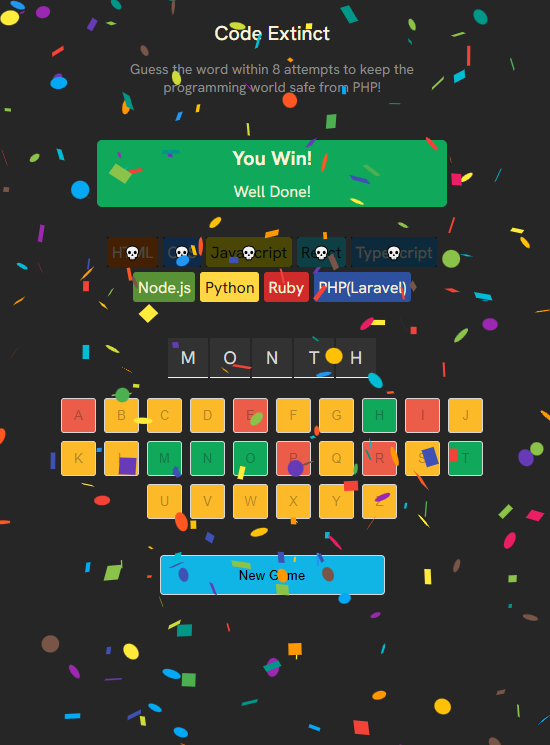

# 🧩 Code Extinct

Code Extinct is a fun twist on the classic Hangman game — built with Vite + React.  
You’ll be guessing letters to save programming languages from extinction. Every wrong guess wipes out one language from existence until only one remains... then it’s game over.

---

## 🚀 Features

- 🎯 Letter Guessing Game: Guess letters to uncover the hidden word.  
- 💥 Extinction Mechanic: You start with 9 programming languages — each wrong guess wipes one out.  
- 🎉 Confetti Celebration: A colorful confetti drop when you guess the word correctly.  
- 🪦 Farewell Messages: Each time a language “goes extinct,” a random farewell message appears.  
- 🔁 New Game Button: Restart anytime and try to save all languages again.

---

## 🎮 How to Play

1. Click letters to guess the hidden word.  
2. You have 8 chances to make mistakes — the 9th language is your last survivor.  
3. Each wrong guess makes one programming language go extinct.  
4. Guess the word correctly to trigger confetti and save them all.  
5. Miss too many and watch your favorite languages vanish one by one.

---

## 🧠 Tech Stack

- React + Vite
- JavaScript (ES6)
- CSS / Styled Components
- React-Confetti for the celebration effect

---

## 🧩 Future Improvements

- Add word difficulty levels (easy, medium, hard)  
- Include sound effects for correct/wrong guesses  
- Show word hints after multiple failed attempts  
- Animate the extinction with fading or shrinking language icons  
- Add score tracking and leaderboard

---

## ⚙️ Installation
# Clone the repo
git clone https://github.com/ceezign/Code-Extinct-react-.git

# Navigate into the folder
cd code-extinct

# Install dependencies
npm install

# Run locally
npm run dev

Then open the local URL shown in your terminal (usually [http://localhost:5173](http://localhost:5173)).

---

## 🖼️ Demo

🔗 Live Demo: [https://your-live-link.netlify.app](#)  

---

## 💬 About

Code Extinct was built for fun by Atunde Toheeb Ayomide (Jiggy) — blending creativity, coding, and a bit of dark humor into a word-guessing game for devs.

---

### 🧠 Save the code. Don’t let them go extinct!